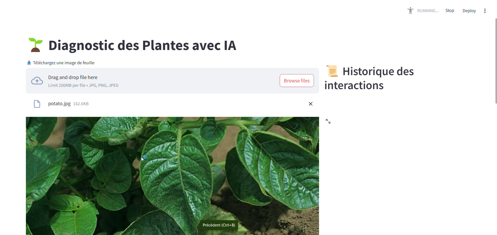
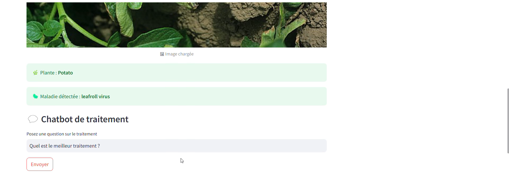
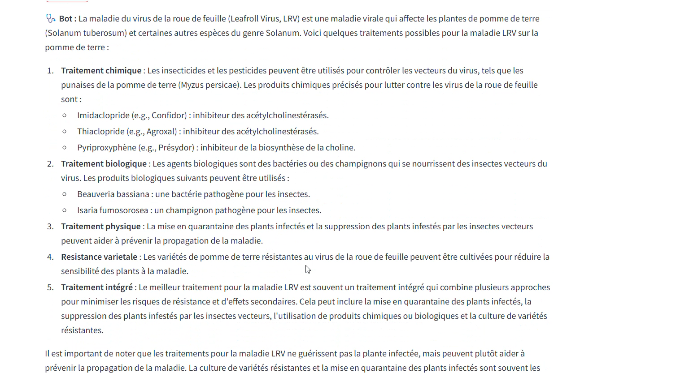
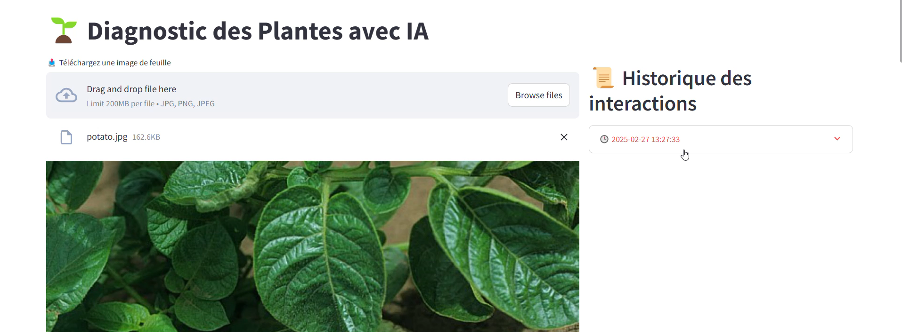

# 🌿 Flora Scan

**Flora Scan** est une application intelligente qui permet la **détection automatique des maladies des plantes**, la **classification des espèces végétales**, et la **recommandation de solutions** adaptées.

Ce projet s’appuie sur des techniques de Deep Learning et une interface conviviale pour aider les agriculteurs, étudiants et chercheurs à diagnostiquer rapidement l’état de santé des plantes.

---

## 🖼️ Aperçu de l’application

- **Page d’accueil**  
  

- **Analyse d’image et détection de maladie**  
  

- **Résultat avec diagnostic et recommandations**  
  
  
- **Historique de conversation**
  

## 🌱 Objectifs

- Détection des maladies à partir d’images de feuilles.
- Classification de l’espèce végétale.
- Fourniture de recommandations intelligentes (traitements, conseils).
- Interface web simple et accessible.

---

## 🧠 Technologies utilisées

- **PIL (Pillow)** : pour le traitement des images.
- **TensorFlow** : entraînement et déploiement de modèles CNN.
- **PyTorch** : exploration de modèles alternatifs.
- **Chat Groq (LLM)** : pour la génération de conseils et d’explications.
- **Streamlit** : création de l’interface utilisateur.

---

## 📂 Dataset

Le modèle est entraîné à partir du [**PlantVillage Dataset** sur Kaggle](https://www.kaggle.com/datasets/emmarex/plantdisease), comprenant des milliers d’images annotées de feuilles malades ou saines.

---

